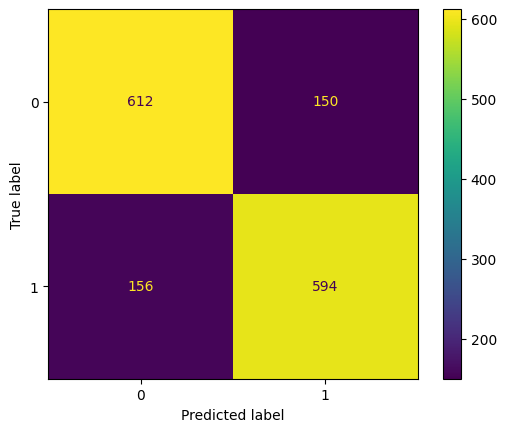
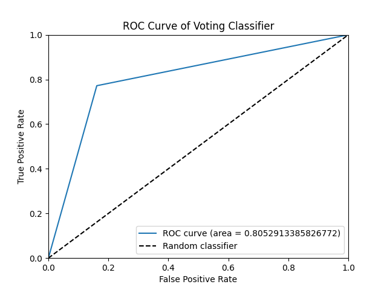

# 🚀 Spaceship Titanic - Machine Learning Project

Welcome to the **Spaceship Titanic** repository! This project applies machine learning to predict passenger survival in a fictional interstellar disaster scenario, inspired by the Kaggle competition.

This project is part of an **ongoing Kaggle competition**, where participants aim to develop the best predictive model for determining whether a passenger was transported to another dimension.

The machine learning model achieved an accuracy of 80.3%, highlighting the strength of feature engineering, preprocessing techniques, and model optimization strategies.

---

## 📌 Project Overview

The goal of this project is to classify whether a passenger was transported to another dimension based on various features such as age, cabin type, and spending habits on the spaceship.

## 📂 Folder Structure

```plaintext
📦 Spaceship_Titanic
├── 📂 data/                 # Raw and processed datasets
├── 📂 notebooks/            # Jupyter notebooks for EDA and training
├── 📂 src/                  # Source code for preprocessing, training, and inference
│   ├── preprocessing.py
│   ├── train_model.py
│   ├── predict.py
│   ├── utils.py
├── 📂 models/               # Saved trained models
├── 📂 reports/              # Generated reports and visualizations
├── 📄 main.ipynb            # Complete project to explore various steps involved
├── 📄 requirements.txt      # Dependencies
├── 📄 README.md             # Project documentation
└── 📄 .gitignore            # Ignored files

```

## 🛠Installation ⚙️

1️⃣ Clone the repository:

    git clone https://github.com/krutarthjankat/Spaceship_Titanic.git
    cd Spaceship_Titanic

2️⃣ Install dependencies:

    pip install -r requirements.txt
    
3️⃣ Run the main notebook:

Open ```main.ipynb``` in Jupyter Notebook and execute the cells to preprocess data, train the model, and make predictions.

## 📊 Results & Visualizations 🎨📊

Model was evaluated using various performance metrics and visualizations:

| |
| :-: |
|  🎯 Feature Correlation
  
📊 Confusion Matrix
 
📈 ROC Curve
  


